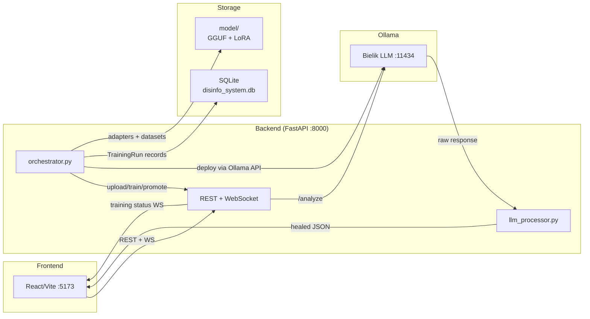

# CLAUDE.md

## Project Overview

Polish-language disinformation detection system using Explainable AI (XAI). Identifies 11 manipulation techniques in media texts via a fine-tuned Bielik-4.5B LLM with LoRA adapters. Engineering thesis project ("praca inżynierska").

## Commands

Bash commands are automatically anchored to the repo root by a PreToolUse hook — no `cd` needed before running project commands.

### Docker

See [DOCKER.md](DOCKER.md) for full details. Quick reference:

- **Start:** `docker compose up` (dev mode with hot-reload)
- **Rebuild:** `docker compose build backend` (only when `requirements*.txt` or `Dockerfile` change)
- **Logs:** `docker compose logs <service>`; training logs at `/app/logs/` inside backend container

### Backend lint/format/test (venv required)

- **Lint:** `cd backend && .venv/Scripts/ruff check app tests`
- **Format:** `cd backend && .venv/Scripts/ruff format app tests`
- **Tests:** `cd backend && .venv/Scripts/python -m pytest tests/` (integration tests need `--run-integration`)
- Config: `backend/ruff.toml` (excludes `vendor/` and `.venv/`)

### Frontend build/lint

- `cd frontend && npm run build`
- `cd frontend && npm run lint`

## Architecture

### Key flows

- **Analysis:** Frontend → `/analyze` → Ollama `/api/chat` → LLM → `normalize_llm_response()` (3-phase healing: JSON parse → schema normalization → tag validation) → structured result
- **MLOps pipeline:** Upload `.jsonl` → trainer.py (Unsloth SFT) → benchmark.py → converter.py (HF→GGUF) → hot-swap via Ollama HTTP API (`/api/create`). Progress via callbacks → WebSocket broadcast.

## Key Design Decisions

- **LLM response healing** (`llm_processor.py`): 3-phase pipeline (JSON parse → regex recovery → fuzzy normalization). Changes to output schema must update both `VALID_TAGS` and regex patterns.

- **11 technique tags** defined in `backend/app/llm_processor.py` (`VALID_TAGS`) and `frontend/src/services/disinformationDetector.js` (`TECHNIQUE_MAPPING`) — **must stay in sync**.

- **Ollama Modelfile** (`model/Modelfile`) uses ChatML template (`<|im_start|>`, `<|im_end|>`) — critical for Bielik. System prompt defines JSON output format and allowed technique categories.

- **Training runs inside Docker backend container** (GPU passthrough). `ProgressCallback` POSTs progress to `{BACKEND_URL}/training/progress` (`http://backend:8000` in Docker).

- **Unsloth tokenizer pickling** (`trainer.py`): `Dataset.map(num_proc=N)` crashes for `N > 1` due to `ConfigModuleInstance`. Module-level monkey-patch forces `num_proc=None`. Do NOT set `dataset_num_proc` in `SFTConfig`.

- **Ollama deployment via HTTP API**: `deploy_new_adapter()` calls Ollama `/api/create` via `httpx.AsyncClient.stream()` with 300s timeout, sending Modelfile content in the request body. Path rewriting maps `/app/model/` → `/model/` for the Ollama container. GGUF adapter must have `.gguf` extension. Streaming NDJSON responses are parsed for error detection.

- **Baseline metrics** read from `model/benchmark-reports/current_baseline_report.txt` via regex in `orchestrator.py`.

## Environment

- Git submodule: `backend/vendor/llama.cpp` (`git submodule update --init --recursive`)
- Database: `backend/disinfo_system.db` (SQLite)
- Test dataset: `model/dataset/mipd_test.jsonl` (1521 documents)
- Model files: `model/bielik-4.5b-base/` (GGUF base), `model/xai-adapter/` (production LoRA)

## UI Language

Entire UI and system prompts are in Polish. Technique names are Polish translations (e.g., `STRAWMAN` → "Chochoł (Słomiana kukła)").

## Git Commits

Do not add "Co-Authored-By: Claude ..." or any AI attribution lines to commit messages.

@~/.claude/shared/adr-workflow.md