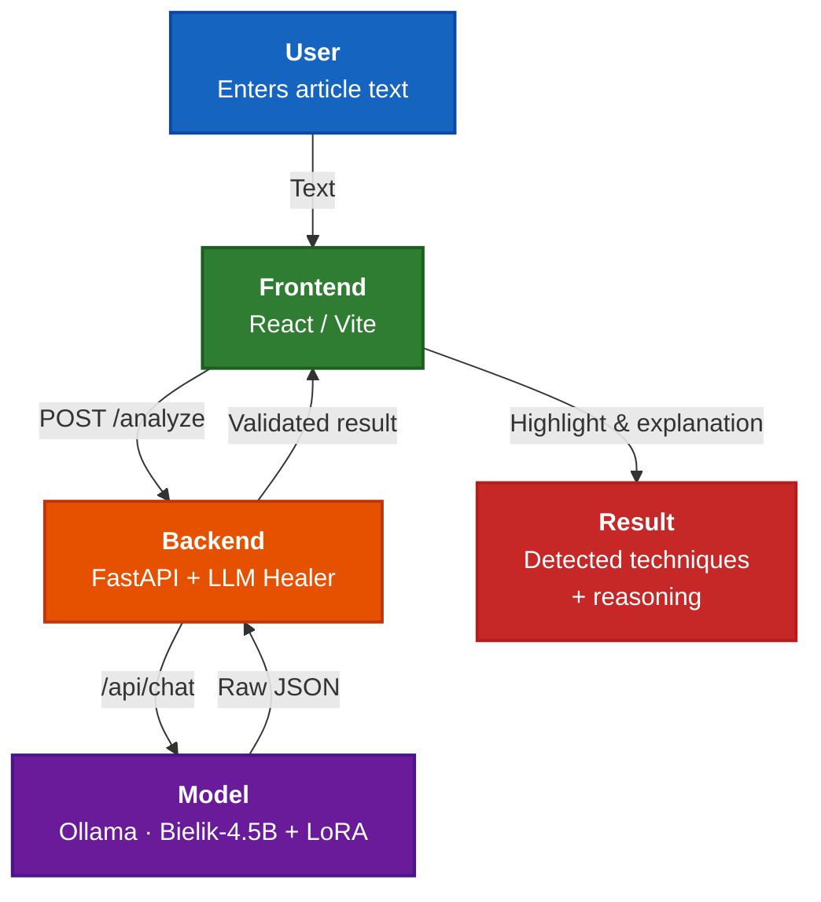
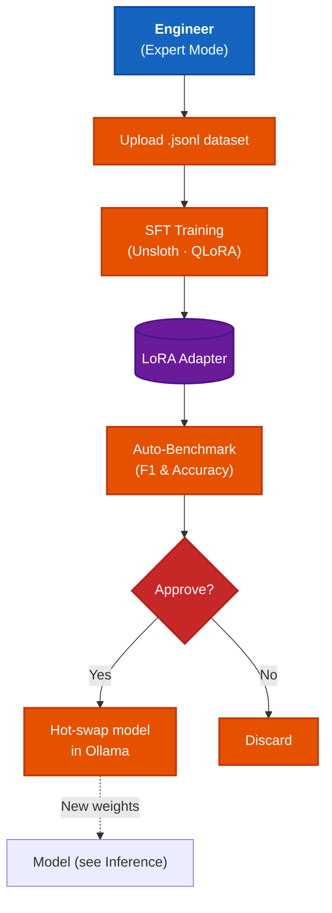
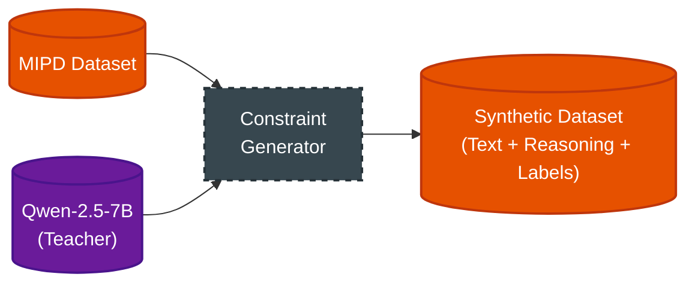

# Architecture Diagram

## Inference Pipeline (Primary)

```mermaid
graph TD
    classDef user fill:#1565c0,stroke:#0d47a1,stroke-width:2px,color:#fff;
    classDef frontend fill:#2e7d32,stroke:#1b5e20,stroke-width:2px,color:#fff;
    classDef backend fill:#e65100,stroke:#bf360c,stroke-width:2px,color:#fff;
    classDef model fill:#6a1b9a,stroke:#4a148c,stroke-width:2px,color:#fff;
    classDef result fill:#c62828,stroke:#b71c1c,stroke-width:2px,color:#fff;

    User["<b>User</b><br/>Enters article text"]:::user
    FE["<b>Frontend</b><br/>React / Vite"]:::frontend
    BE["<b>Backend</b><br/>FastAPI + LLM Healer"]:::backend
    LLM["<b>Model</b><br/>Ollama · Bielik-4.5B + LoRA"]:::model
    Result["<b>Result</b><br/>Detected techniques<br/>+ reasoning"]:::result

    User -->|Text| FE
    FE -->|POST /analyze| BE
    BE -->|/api/chat| LLM
    LLM -->|Raw JSON| BE
    BE -->|Validated result| FE
    FE -->|Highlight & explanation| Result
```

## MLOps Retraining Loop (Secondary)

```mermaid
graph TD
    classDef human fill:#1565c0,stroke:#0d47a1,stroke-width:2px,color:#fff;
    classDef process fill:#e65100,stroke:#bf360c,stroke-width:2px,color:#fff;
    classDef model fill:#6a1b9a,stroke:#4a148c,stroke-width:2px,color:#fff;
    classDef decision fill:#c62828,stroke:#b71c1c,stroke-width:2px,color:#fff;

    Eng["<b>Engineer</b><br/>(Expert Mode)"]:::human
    Upload["Upload .jsonl dataset"]:::process
    Train["SFT Training<br/>(Unsloth · QLoRA)"]:::process
    Adapter[("LoRA Adapter")]:::model
    Bench["Auto-Benchmark<br/>(F1 & Accuracy)"]:::process
    Approve{"Approve?"}:::decision

    Eng --> Upload --> Train --> Adapter --> Bench --> Approve
    Approve -->|Yes| Deploy["Hot-swap model<br/>in Ollama"]:::process
    Approve -->|No| Discard["Discard"]:::process

    Deploy -.->|New weights| LLM_REF["Model (see Inference)"]
```

## Data Generation Pipeline (Offline, Pre-Project)

```mermaid
graph LR
    classDef data fill:#e65100,stroke:#bf360c,stroke-width:2px,color:#fff;
    classDef model fill:#6a1b9a,stroke:#4a148c,stroke-width:2px,color:#fff;
    classDef process fill:#37474f,stroke:#263238,stroke-width:2px,color:#fff,stroke-dasharray: 5 5;

    MIPD[("MIPD Dataset")]:::data
    Qwen[("Qwen-2.5-7B<br/>(Teacher)")]:::model
    Gen["Constraint<br/>Generator"]:::process
    CoT[("Synthetic Dataset<br/>(Text + Reasoning + Labels)")]:::data

    MIPD --> Gen
    Qwen --> Gen --> CoT
```