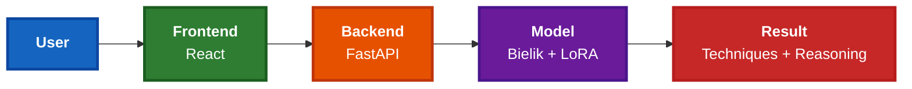
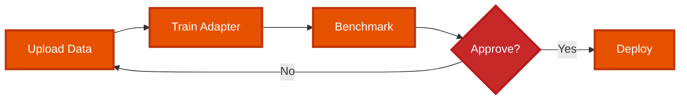

# Architecture Diagram — Presentation Variant

> Horizontal layout, minimal detail. Designed for PowerPoint / thesis defence slides.

## Main Flow

```mermaid
graph LR
    classDef user fill:#1565c0,stroke:#0d47a1,stroke-width:3px,color:#fff;
    classDef fe fill:#2e7d32,stroke:#1b5e20,stroke-width:3px,color:#fff;
    classDef be fill:#e65100,stroke:#bf360c,stroke-width:3px,color:#fff;
    classDef llm fill:#6a1b9a,stroke:#4a148c,stroke-width:3px,color:#fff;
    classDef res fill:#c62828,stroke:#b71c1c,stroke-width:3px,color:#fff;

    User["<b>User</b>"]:::user
    FE["<b>Frontend</b><br/>React"]:::fe
    BE["<b>Backend</b><br/>FastAPI"]:::be
    LLM["<b>Model</b><br/>Bielik + LoRA"]:::llm
    Result["<b>Result</b><br/>Techniques + Reasoning"]:::res

    User --> FE --> BE --> LLM --> Result
```

## Retraining Loop (optional slide)

```mermaid
graph LR
    classDef proc fill:#e65100,stroke:#bf360c,stroke-width:3px,color:#fff;
    classDef dec fill:#c62828,stroke:#b71c1c,stroke-width:3px,color:#fff;

    Upload["Upload Data"]:::proc
    Train["Train Adapter"]:::proc
    Bench["Benchmark"]:::proc
    Approve{"Approve?"}:::dec
    Deploy["Deploy"]:::proc

    Upload --> Train --> Bench --> Approve
    Approve -->|Yes| Deploy
    Approve -->|No| Upload
```